<!-- PROFILE:START -->

# Data Structures & Algorithms — Practice Log

*Python solutions to LeetCode problems — my data structures, algorithms, and interview-prep journal.*

<picture><source media="(prefers-color-scheme: dark)" srcset="assets/stats-banner-dark.svg"></picture>

[Overview](#overview) &nbsp;&bull;&nbsp; [Activity](#activity) &nbsp;&bull;&nbsp; [Competitive](#competitive-standing) &nbsp;&bull;&nbsp; [NeetCode 150](#neetcode-150) &nbsp;&bull;&nbsp; [Topics](#topics) &nbsp;&bull;&nbsp; [Solutions](#solutions)

---

## Overview

Average submission beats **58%** on runtime. Last updated **2026-07-09**.

<picture><source media="(prefers-color-scheme: dark)" srcset="assets/difficulty-donut-dark.svg"></picture>

---

## Activity

| This week | This month | Active days |
| :-------: | :--------: | :---------: |
| **4** ⬇ -11 vs last week | **16** | **16** |

<picture><source media="(prefers-color-scheme: dark)" srcset="assets/activity-heatmap-dark.svg"></picture>

**Recently solved**

| Date | # | Problem | Difficulty |
| :--- | --: | :------ | :--------- |
| 2026-07-08 | 226 | [Invert Binary Tree](https://github.com/tquangdang/dsa_practice/tree/main/0226-invert-binary-tree) | 🟢 Easy |
| 2026-07-07 | 287 | [Find the Duplicate Number](https://github.com/tquangdang/dsa_practice/tree/main/0287-find-the-duplicate-number) | 🟡 Medium |
| 2026-07-07 | 138 | [Copy List with Random Pointer](https://github.com/tquangdang/dsa_practice/tree/main/0138-copy-list-with-random-pointer) | 🟡 Medium |
| 2026-07-07 | 2 | [Add Two Numbers](https://github.com/tquangdang/dsa_practice/tree/main/0002-add-two-numbers) | 🟡 Medium |
| 2026-07-04 | 206 | [Reverse Linked List](https://github.com/tquangdang/dsa_practice/tree/main/0206-reverse-linked-list) | 🟢 Easy |

---

## Competitive Standing

| Metric | Value |
| :----- | :---- |
| Global rank | [#639,892](https://leetcode.com/u/quang_dang/) worldwide |
| Contest rating | 1430 |
| Contest rank | #613,918 / 874,830 (top 70.54%) |
| Contests attended | 2 |
| Contest badge | none yet |

> Next tier: **Knight** (~1850 rating, approx) — 420 rating to go.

---

## NeetCode 150

Working through the [NeetCode 150](https://neetcode.io/practice) roadmap: **46 / 150** complete.

<picture><source media="(prefers-color-scheme: dark)" srcset="assets/neetcode-dark.svg"></picture>

---

## Topics

<picture><source media="(prefers-color-scheme: dark)" srcset="assets/topics-dark.svg"></picture>

+18 more topics

---

## Solutions

Runtime / memory percentiles are from my accepted LeetCode submissions, grouped by NeetCode 150 category.

<strong>Arrays & Hashing</strong> &nbsp;(8 / 9)

| # | Problem | Difficulty | Runtime | Memory |
| --: | :------ | :--------- | :------ | :----- |
| 1 | [Two Sum](https://github.com/tquangdang/dsa_practice/tree/main/0001-two-sum) | 🟢 Easy | 0 ms (100%) | 20.4 MB (59%) |
| 36 | [Valid Sudoku](https://github.com/tquangdang/dsa_practice/tree/main/0036-valid-sudoku) | 🟡 Medium | 2 ms (80%) | 19.3 MB (74%) |
| 49 | [Group Anagrams](https://github.com/tquangdang/dsa_practice/tree/main/0049-group-anagrams) | 🟡 Medium | 11 ms (84%) | 22.0 MB (80%) |
| 128 | [Longest Consecutive Sequence](https://github.com/tquangdang/dsa_practice/tree/main/0128-longest-consecutive-sequence) | 🟡 Medium | 56 ms (30%) | 36.7 MB (21%) |
| 217 | [Contains Duplicate](https://github.com/tquangdang/dsa_practice/tree/main/0217-contains-duplicate) | 🟢 Easy | 8 ms (78%) | 31.2 MB (72%) |
| 238 | [Product of Array Except Self](https://github.com/tquangdang/dsa_practice/tree/main/0238-product-of-array-except-self) | 🟡 Medium | 19 ms (76%) | 25.4 MB (81%) |
| 242 | [Valid Anagram](https://github.com/tquangdang/dsa_practice/tree/main/0242-valid-anagram) | 🟢 Easy | 13 ms (50%) | 19.5 MB (45%) |
| 347 | [Top K Frequent Elements](https://github.com/tquangdang/dsa_practice/tree/main/0347-top-k-frequent-elements) | 🟡 Medium | 4 ms (68%) | 22.8 MB (82%) |

<strong>Two Pointers</strong> &nbsp;(5 / 5)

| # | Problem | Difficulty | Runtime | Memory |
| --: | :------ | :--------- | :------ | :----- |
| 11 | [Container With Most Water](https://github.com/tquangdang/dsa_practice/tree/main/0011-container-with-most-water) | 🟡 Medium | 59 ms (52%) | 29.4 MB (98%) |
| 15 | [3Sum](https://github.com/tquangdang/dsa_practice/tree/main/0015-3sum) | 🟡 Medium | 643 ms (53%) | 22.3 MB (54%) |
| 42 | [Trapping Rain Water](https://github.com/tquangdang/dsa_practice/tree/main/0042-trapping-rain-water) | 🔴 Hard | 3 ms (95%) | 21.0 MB (84%) |
| 125 | [Valid Palindrome](https://github.com/tquangdang/dsa_practice/tree/main/0125-valid-palindrome) | 🟢 Easy | 11 ms (33%) | 19.8 MB (42%) |
| 167 | [Two Sum II - Input Array Is Sorted](https://github.com/tquangdang/dsa_practice/tree/main/0167-two-sum-ii-input-array-is-sorted) | 🟡 Medium | 6 ms (32%) | 20.7 MB (8%) |

<strong>Sliding Window</strong> &nbsp;(6 / 6)

| # | Problem | Difficulty | Runtime | Memory |
| --: | :------ | :--------- | :------ | :----- |
| 3 | [Longest Substring Without Repeating Characters](https://github.com/tquangdang/dsa_practice/tree/main/0003-longest-substring-without-repeating-characters) | 🟡 Medium | 19 ms (23%) | 19.4 MB (8%) |
| 76 | [Minimum Window Substring](https://github.com/tquangdang/dsa_practice/tree/main/0076-minimum-window-substring) | 🔴 Hard | 159 ms (19%) | 19.8 MB (37%) |
| 121 | [Best Time to Buy and Sell Stock](https://github.com/tquangdang/dsa_practice/tree/main/0121-best-time-to-buy-and-sell-stock) | 🟢 Easy | 62 ms (28%) | 28.7 MB (42%) |
| 239 | [Sliding Window Maximum](https://github.com/tquangdang/dsa_practice/tree/main/0239-sliding-window-maximum) | 🔴 Hard | 207 ms (28%) | 35.6 MB (21%) |
| 424 | [Longest Repeating Character Replacement](https://github.com/tquangdang/dsa_practice/tree/main/0424-longest-repeating-character-replacement) | 🟡 Medium | 172 ms (16%) | 19.6 MB (85%) |
| 567 | [Permutation in String](https://github.com/tquangdang/dsa_practice/tree/main/0567-permutation-in-string) | 🟡 Medium | 71 ms (20%) | 19.3 MB (53%) |

<strong>Stack</strong> &nbsp;(7 / 7)

| # | Problem | Difficulty | Runtime | Memory |
| --: | :------ | :--------- | :------ | :----- |
| 20 | [Valid Parentheses](https://github.com/tquangdang/dsa_practice/tree/main/0020-valid-parentheses) | 🟢 Easy | 0 ms (100%) | 19.1 MB (99%) |
| 22 | [Generate Parentheses](https://github.com/tquangdang/dsa_practice/tree/main/0022-generate-parentheses) | 🟡 Medium | 3 ms (30%) | 19.4 MB (34%) |
| 84 | [Largest Rectangle in Histogram](https://github.com/tquangdang/dsa_practice/tree/main/0084-largest-rectangle-in-histogram) | 🔴 Hard | 113 ms (78%) | 36.5 MB (21%) |
| 150 | [Evaluate Reverse Polish Notation](https://github.com/tquangdang/dsa_practice/tree/main/0150-evaluate-reverse-polish-notation) | 🟡 Medium | 0 ms (100%) | 20.5 MB (93%) |
| 155 | [Min Stack](https://github.com/tquangdang/dsa_practice/tree/main/0155-min-stack) | 🟡 Medium | 105 ms (24%) | 33.0 MB (5%) |
| 739 | [Daily Temperatures](https://github.com/tquangdang/dsa_practice/tree/main/0739-daily-temperatures) | 🟡 Medium | 102 ms (46%) | 29.4 MB (27%) |
| 853 | [Car Fleet](https://github.com/tquangdang/dsa_practice/tree/main/0853-car-fleet) | 🟡 Medium | 194 ms (37%) | 41.8 MB (35%) |

<strong>Binary Search</strong> &nbsp;(5 / 7)

| # | Problem | Difficulty | Runtime | Memory |
| --: | :------ | :--------- | :------ | :----- |
| 74 | [Search a 2D Matrix](https://github.com/tquangdang/dsa_practice/tree/main/0074-search-a-2d-matrix) | 🟡 Medium | 49 ms (0%) | 19.5 MB (77%) |
| 153 | [Find Minimum in Rotated Sorted Array](https://github.com/tquangdang/dsa_practice/tree/main/0153-find-minimum-in-rotated-sorted-array) | 🟡 Medium | 0 ms (100%) | 19.3 MB (66%) |
| 704 | [Binary Search](https://github.com/tquangdang/dsa_practice/tree/main/0704-binary-search) | 🟢 Easy | 0 ms (100%) | 20.6 MB (35%) |
| 875 | [Koko Eating Bananas](https://github.com/tquangdang/dsa_practice/tree/main/0875-koko-eating-bananas) | 🟡 Medium | 183 ms (33%) | 20.7 MB (42%) |
| 981 | [Time Based Key-Value Store](https://github.com/tquangdang/dsa_practice/tree/main/0981-time-based-key-value-store) | 🟡 Medium | 151 ms (30%) | 69.8 MB (21%) |

<strong>Linked List</strong> &nbsp;(7 / 11)

| # | Problem | Difficulty | Runtime | Memory |
| --: | :------ | :--------- | :------ | :----- |
| 2 | [Add Two Numbers](https://github.com/tquangdang/dsa_practice/tree/main/0002-add-two-numbers) | 🟡 Medium | 8 ms (13%) | 19.1 MB (96%) |
| 19 | [Remove Nth Node From End of List](https://github.com/tquangdang/dsa_practice/tree/main/0019-remove-nth-node-from-end-of-list) | 🟡 Medium | 0 ms (100%) | 19.3 MB (63%) |
| 21 | [Merge Two Sorted Lists](https://github.com/tquangdang/dsa_practice/tree/main/0021-merge-two-sorted-lists) | 🟢 Easy | 1 ms (19%) | 19.2 MB (94%) |
| 138 | [Copy List with Random Pointer](https://github.com/tquangdang/dsa_practice/tree/main/0138-copy-list-with-random-pointer) | 🟡 Medium | 32 ms (100%) | 20.2 MB (19%) |
| 143 | [Reorder List](https://github.com/tquangdang/dsa_practice/tree/main/0143-reorder-list) | 🟡 Medium | 3 ms (52%) | 28.0 MB (22%) |
| 206 | [Reverse Linked List](https://github.com/tquangdang/dsa_practice/tree/main/0206-reverse-linked-list) | 🟢 Easy | 0 ms (100%) | 20.5 MB (65%) |
| 287 | [Find the Duplicate Number](https://github.com/tquangdang/dsa_practice/tree/main/0287-find-the-duplicate-number) | 🟡 Medium | 203 ms (5%) | 33.5 MB (49%) |

<strong>Trees</strong> &nbsp;(1 / 15)

| # | Problem | Difficulty | Runtime | Memory |
| --: | :------ | :--------- | :------ | :----- |
| 226 | [Invert Binary Tree](https://github.com/tquangdang/dsa_practice/tree/main/0226-invert-binary-tree) | 🟢 Easy | 0 ms (100%) | 19.3 MB (20%) |

<strong>Heap / Priority Queue</strong> &nbsp;(4 / 7)

| # | Problem | Difficulty | Runtime | Memory |
| --: | :------ | :--------- | :------ | :----- |
| 215 | [Kth Largest Element in an Array](https://github.com/tquangdang/dsa_practice/tree/main/0215-kth-largest-element-in-an-array) | 🟡 Medium | 105 ms (21%) | 31.4 MB (13%) |
| 703 | [Kth Largest Element in a Stream](https://github.com/tquangdang/dsa_practice/tree/main/0703-kth-largest-element-in-a-stream) | 🟢 Easy | 7 ms (97%) | 25.4 MB (79%) |
| 973 | [K Closest Points to Origin](https://github.com/tquangdang/dsa_practice/tree/main/0973-k-closest-points-to-origin) | 🟡 Medium | 82 ms (23%) | 24.9 MB (44%) |
| 1046 | [Last Stone Weight](https://github.com/tquangdang/dsa_practice/tree/main/1046-last-stone-weight) | 🟢 Easy | 2 ms (15%) | 19.4 MB (35%) |

<strong>Math & Geometry</strong> &nbsp;(2 / 8)

| # | Problem | Difficulty | Runtime | Memory |
| --: | :------ | :--------- | :------ | :----- |
| 66 | [Plus One](https://github.com/tquangdang/dsa_practice/tree/main/0066-plus-one) | 🟢 Easy | 0 ms (100%) | 19.1 MB (98%) |
| 202 | [Happy Number](https://github.com/tquangdang/dsa_practice/tree/main/0202-happy-number) | 🟢 Easy | 2 ms (43%) | 19.4 MB (6%) |

<strong>Bit Manipulation</strong> &nbsp;(1 / 7)

| # | Problem | Difficulty | Runtime | Memory |
| --: | :------ | :--------- | :------ | :----- |
| 136 | [Single Number](https://github.com/tquangdang/dsa_practice/tree/main/0136-single-number) | 🟢 Easy | 0 ms (100%) | 21.1 MB (69%) |

<strong>Other practice (not in NeetCode 150)</strong> &nbsp;(7)

| # | Problem | Difficulty | Runtime | Memory |
| --: | :------ | :--------- | :------ | :----- |
| 27 | [Remove Element](https://github.com/tquangdang/dsa_practice/tree/main/0027-remove-element) | 🟢 Easy | 0 ms (100%) | 19.3 MB (18%) |
| 35 | [Search Insert Position](https://github.com/tquangdang/dsa_practice/tree/main/0035-search-insert-position) | 🟢 Easy | 0 ms (100%) | 19.9 MB (42%) |
| 169 | [Majority Element](https://github.com/tquangdang/dsa_practice/tree/main/0169-majority-element) | 🟢 Easy | 1 ms (89%) | 21.2 MB (51%) |
| 1732 | [Find the Highest Altitude](https://github.com/tquangdang/dsa_practice/tree/main/1732-find-the-highest-altitude) | 🟢 Easy | 0 ms (100%) | 19.3 MB (52%) |
| 3432 | [Count Partitions with Even Sum Difference](https://github.com/tquangdang/dsa_practice/tree/main/3432-count-partitions-with-even-sum-difference) | 🟢 Easy | 3 ms (25%) | 19.1 MB (85%) |
| 3516 | [Find Closest Person](https://github.com/tquangdang/dsa_practice/tree/main/3516-find-closest-person) | 🟢 Easy | 0 ms (100%) | 19.2 MB (58%) |
| 3745 | [Maximize Expression of Three Elements](https://github.com/tquangdang/dsa_practice/tree/main/3745-maximize-expression-of-three-elements) | 🟢 Easy | 6 ms (6%) | 19.6 MB (5%) |

---

Auto-generated from the repository after each commit by [`scripts/generate_readme.py`](https://github.com/tquangdang/dsa_practice/tree/main/scripts/generate_readme.py). Problems synced via [LeetHub v2](https://github.com/arunbhardwaj/LeetHub-2.0).

<!-- PROFILE:END -->

Raw LeetHub topic index (auto-generated — do not edit)

<!---LeetCode Topics Start-->
# LeetCode Topics
## Hash Table
|  |
| ------- |
| [0001-two-sum](https://github.com/tquangdang/dsa_practice/tree/master/0001-two-sum) |
| [0003-longest-substring-without-repeating-characters](https://github.com/tquangdang/dsa_practice/tree/master/0003-longest-substring-without-repeating-characters) |
| [0049-group-anagrams](https://github.com/tquangdang/dsa_practice/tree/master/0049-group-anagrams) |
| [0076-minimum-window-substring](https://github.com/tquangdang/dsa_practice/tree/master/0076-minimum-window-substring) |
| [0138-copy-list-with-random-pointer](https://github.com/tquangdang/dsa_practice/tree/master/0138-copy-list-with-random-pointer) |
| [0169-majority-element](https://github.com/tquangdang/dsa_practice/tree/master/0169-majority-element) |
| [0202-happy-number](https://github.com/tquangdang/dsa_practice/tree/master/0202-happy-number) |
| [0217-contains-duplicate](https://github.com/tquangdang/dsa_practice/tree/master/0217-contains-duplicate) |
| [0242-valid-anagram](https://github.com/tquangdang/dsa_practice/tree/master/0242-valid-anagram) |
| [0424-longest-repeating-character-replacement](https://github.com/tquangdang/dsa_practice/tree/master/0424-longest-repeating-character-replacement) |
| [0567-permutation-in-string](https://github.com/tquangdang/dsa_practice/tree/master/0567-permutation-in-string) |
| [0981-time-based-key-value-store](https://github.com/tquangdang/dsa_practice/tree/master/0981-time-based-key-value-store) |
## String
|  |
| ------- |
| [0003-longest-substring-without-repeating-characters](https://github.com/tquangdang/dsa_practice/tree/master/0003-longest-substring-without-repeating-characters) |
| [0020-valid-parentheses](https://github.com/tquangdang/dsa_practice/tree/master/0020-valid-parentheses) |
| [0022-generate-parentheses](https://github.com/tquangdang/dsa_practice/tree/master/0022-generate-parentheses) |
| [0049-group-anagrams](https://github.com/tquangdang/dsa_practice/tree/master/0049-group-anagrams) |
| [0076-minimum-window-substring](https://github.com/tquangdang/dsa_practice/tree/master/0076-minimum-window-substring) |
| [0242-valid-anagram](https://github.com/tquangdang/dsa_practice/tree/master/0242-valid-anagram) |
| [0424-longest-repeating-character-replacement](https://github.com/tquangdang/dsa_practice/tree/master/0424-longest-repeating-character-replacement) |
| [0567-permutation-in-string](https://github.com/tquangdang/dsa_practice/tree/master/0567-permutation-in-string) |
| [0981-time-based-key-value-store](https://github.com/tquangdang/dsa_practice/tree/master/0981-time-based-key-value-store) |
## Sliding Window
|  |
| ------- |
| [0003-longest-substring-without-repeating-characters](https://github.com/tquangdang/dsa_practice/tree/master/0003-longest-substring-without-repeating-characters) |
| [0076-minimum-window-substring](https://github.com/tquangdang/dsa_practice/tree/master/0076-minimum-window-substring) |
| [0239-sliding-window-maximum](https://github.com/tquangdang/dsa_practice/tree/master/0239-sliding-window-maximum) |
| [0424-longest-repeating-character-replacement](https://github.com/tquangdang/dsa_practice/tree/master/0424-longest-repeating-character-replacement) |
| [0567-permutation-in-string](https://github.com/tquangdang/dsa_practice/tree/master/0567-permutation-in-string) |
## Tree
|  |
| ------- |
| [0226-invert-binary-tree](https://github.com/tquangdang/dsa_practice/tree/master/0226-invert-binary-tree) |
| [0703-kth-largest-element-in-a-stream](https://github.com/tquangdang/dsa_practice/tree/master/0703-kth-largest-element-in-a-stream) |
## Design
|  |
| ------- |
| [0155-min-stack](https://github.com/tquangdang/dsa_practice/tree/master/0155-min-stack) |
| [0703-kth-largest-element-in-a-stream](https://github.com/tquangdang/dsa_practice/tree/master/0703-kth-largest-element-in-a-stream) |
| [0981-time-based-key-value-store](https://github.com/tquangdang/dsa_practice/tree/master/0981-time-based-key-value-store) |
## Binary Search Tree
|  |
| ------- |
| [0035-search-insert-position](https://github.com/tquangdang/dsa_practice/tree/master/0035-search-insert-position) |
| [0074-search-a-2d-matrix](https://github.com/tquangdang/dsa_practice/tree/master/0074-search-a-2d-matrix) |
| [0153-find-minimum-in-rotated-sorted-array](https://github.com/tquangdang/dsa_practice/tree/master/0153-find-minimum-in-rotated-sorted-array) |
| [0167-two-sum-ii-input-array-is-sorted](https://github.com/tquangdang/dsa_practice/tree/master/0167-two-sum-ii-input-array-is-sorted) |
| [0287-find-the-duplicate-number](https://github.com/tquangdang/dsa_practice/tree/master/0287-find-the-duplicate-number) |
| [0703-kth-largest-element-in-a-stream](https://github.com/tquangdang/dsa_practice/tree/master/0703-kth-largest-element-in-a-stream) |
| [0875-koko-eating-bananas](https://github.com/tquangdang/dsa_practice/tree/master/0875-koko-eating-bananas) |
| [0981-time-based-key-value-store](https://github.com/tquangdang/dsa_practice/tree/master/0981-time-based-key-value-store) |
## Heap (Priority Queue)
|  |
| ------- |
| [0215-kth-largest-element-in-an-array](https://github.com/tquangdang/dsa_practice/tree/master/0215-kth-largest-element-in-an-array) |
| [0239-sliding-window-maximum](https://github.com/tquangdang/dsa_practice/tree/master/0239-sliding-window-maximum) |
| [0703-kth-largest-element-in-a-stream](https://github.com/tquangdang/dsa_practice/tree/master/0703-kth-largest-element-in-a-stream) |
| [0973-k-closest-points-to-origin](https://github.com/tquangdang/dsa_practice/tree/master/0973-k-closest-points-to-origin) |
| [1046-last-stone-weight](https://github.com/tquangdang/dsa_practice/tree/master/1046-last-stone-weight) |
## Binary Tree
|  |
| ------- |
| [0226-invert-binary-tree](https://github.com/tquangdang/dsa_practice/tree/master/0226-invert-binary-tree) |
| [0703-kth-largest-element-in-a-stream](https://github.com/tquangdang/dsa_practice/tree/master/0703-kth-largest-element-in-a-stream) |
## Data Stream
|  |
| ------- |
| [0703-kth-largest-element-in-a-stream](https://github.com/tquangdang/dsa_practice/tree/master/0703-kth-largest-element-in-a-stream) |
## Math
|  |
| ------- |
| [0002-add-two-numbers](https://github.com/tquangdang/dsa_practice/tree/master/0002-add-two-numbers) |
| [0066-plus-one](https://github.com/tquangdang/dsa_practice/tree/master/0066-plus-one) |
| [0150-evaluate-reverse-polish-notation](https://github.com/tquangdang/dsa_practice/tree/master/0150-evaluate-reverse-polish-notation) |
| [0202-happy-number](https://github.com/tquangdang/dsa_practice/tree/master/0202-happy-number) |
| [0973-k-closest-points-to-origin](https://github.com/tquangdang/dsa_practice/tree/master/0973-k-closest-points-to-origin) |
## Two Pointers
|  |
| ------- |
| [0015-3sum](https://github.com/tquangdang/dsa_practice/tree/master/0015-3sum) |
| [0019-remove-nth-node-from-end-of-list](https://github.com/tquangdang/dsa_practice/tree/master/0019-remove-nth-node-from-end-of-list) |
| [0027-remove-element](https://github.com/tquangdang/dsa_practice/tree/master/0027-remove-element) |
| [0143-reorder-list](https://github.com/tquangdang/dsa_practice/tree/master/0143-reorder-list) |
| [0167-two-sum-ii-input-array-is-sorted](https://github.com/tquangdang/dsa_practice/tree/master/0167-two-sum-ii-input-array-is-sorted) |
| [0202-happy-number](https://github.com/tquangdang/dsa_practice/tree/master/0202-happy-number) |
| [0287-find-the-duplicate-number](https://github.com/tquangdang/dsa_practice/tree/master/0287-find-the-duplicate-number) |
| [0567-permutation-in-string](https://github.com/tquangdang/dsa_practice/tree/master/0567-permutation-in-string) |
## Array
|  |
| ------- |
| [0001-two-sum](https://github.com/tquangdang/dsa_practice/tree/master/0001-two-sum) |
| [0015-3sum](https://github.com/tquangdang/dsa_practice/tree/master/0015-3sum) |
| [0027-remove-element](https://github.com/tquangdang/dsa_practice/tree/master/0027-remove-element) |
| [0035-search-insert-position](https://github.com/tquangdang/dsa_practice/tree/master/0035-search-insert-position) |
| [0049-group-anagrams](https://github.com/tquangdang/dsa_practice/tree/master/0049-group-anagrams) |
| [0066-plus-one](https://github.com/tquangdang/dsa_practice/tree/master/0066-plus-one) |
| [0074-search-a-2d-matrix](https://github.com/tquangdang/dsa_practice/tree/master/0074-search-a-2d-matrix) |
| [0084-largest-rectangle-in-histogram](https://github.com/tquangdang/dsa_practice/tree/master/0084-largest-rectangle-in-histogram) |
| [0136-single-number](https://github.com/tquangdang/dsa_practice/tree/master/0136-single-number) |
| [0150-evaluate-reverse-polish-notation](https://github.com/tquangdang/dsa_practice/tree/master/0150-evaluate-reverse-polish-notation) |
| [0153-find-minimum-in-rotated-sorted-array](https://github.com/tquangdang/dsa_practice/tree/master/0153-find-minimum-in-rotated-sorted-array) |
| [0167-two-sum-ii-input-array-is-sorted](https://github.com/tquangdang/dsa_practice/tree/master/0167-two-sum-ii-input-array-is-sorted) |
| [0169-majority-element](https://github.com/tquangdang/dsa_practice/tree/master/0169-majority-element) |
| [0215-kth-largest-element-in-an-array](https://github.com/tquangdang/dsa_practice/tree/master/0215-kth-largest-element-in-an-array) |
| [0217-contains-duplicate](https://github.com/tquangdang/dsa_practice/tree/master/0217-contains-duplicate) |
| [0239-sliding-window-maximum](https://github.com/tquangdang/dsa_practice/tree/master/0239-sliding-window-maximum) |
| [0287-find-the-duplicate-number](https://github.com/tquangdang/dsa_practice/tree/master/0287-find-the-duplicate-number) |
| [0739-daily-temperatures](https://github.com/tquangdang/dsa_practice/tree/master/0739-daily-temperatures) |
| [0853-car-fleet](https://github.com/tquangdang/dsa_practice/tree/master/0853-car-fleet) |
| [0875-koko-eating-bananas](https://github.com/tquangdang/dsa_practice/tree/master/0875-koko-eating-bananas) |
| [0973-k-closest-points-to-origin](https://github.com/tquangdang/dsa_practice/tree/master/0973-k-closest-points-to-origin) |
| [1046-last-stone-weight](https://github.com/tquangdang/dsa_practice/tree/master/1046-last-stone-weight) |
## Bit Manipulation
|  |
| ------- |
| [0136-single-number](https://github.com/tquangdang/dsa_practice/tree/master/0136-single-number) |
| [0287-find-the-duplicate-number](https://github.com/tquangdang/dsa_practice/tree/master/0287-find-the-duplicate-number) |
## Divide and Conquer
|  |
| ------- |
| [0169-majority-element](https://github.com/tquangdang/dsa_practice/tree/master/0169-majority-element) |
| [0215-kth-largest-element-in-an-array](https://github.com/tquangdang/dsa_practice/tree/master/0215-kth-largest-element-in-an-array) |
| [0973-k-closest-points-to-origin](https://github.com/tquangdang/dsa_practice/tree/master/0973-k-closest-points-to-origin) |
## Geometry
|  |
| ------- |
| [0973-k-closest-points-to-origin](https://github.com/tquangdang/dsa_practice/tree/master/0973-k-closest-points-to-origin) |
## Sorting
|  |
| ------- |
| [0015-3sum](https://github.com/tquangdang/dsa_practice/tree/master/0015-3sum) |
| [0049-group-anagrams](https://github.com/tquangdang/dsa_practice/tree/master/0049-group-anagrams) |
| [0169-majority-element](https://github.com/tquangdang/dsa_practice/tree/master/0169-majority-element) |
| [0215-kth-largest-element-in-an-array](https://github.com/tquangdang/dsa_practice/tree/master/0215-kth-largest-element-in-an-array) |
| [0217-contains-duplicate](https://github.com/tquangdang/dsa_practice/tree/master/0217-contains-duplicate) |
| [0242-valid-anagram](https://github.com/tquangdang/dsa_practice/tree/master/0242-valid-anagram) |
| [0853-car-fleet](https://github.com/tquangdang/dsa_practice/tree/master/0853-car-fleet) |
| [0973-k-closest-points-to-origin](https://github.com/tquangdang/dsa_practice/tree/master/0973-k-closest-points-to-origin) |
## Quickselect
|  |
| ------- |
| [0215-kth-largest-element-in-an-array](https://github.com/tquangdang/dsa_practice/tree/master/0215-kth-largest-element-in-an-array) |
| [0973-k-closest-points-to-origin](https://github.com/tquangdang/dsa_practice/tree/master/0973-k-closest-points-to-origin) |
## Counting
|  |
| ------- |
| [0169-majority-element](https://github.com/tquangdang/dsa_practice/tree/master/0169-majority-element) |
## Stack
|  |
| ------- |
| [0020-valid-parentheses](https://github.com/tquangdang/dsa_practice/tree/master/0020-valid-parentheses) |
| [0084-largest-rectangle-in-histogram](https://github.com/tquangdang/dsa_practice/tree/master/0084-largest-rectangle-in-histogram) |
| [0143-reorder-list](https://github.com/tquangdang/dsa_practice/tree/master/0143-reorder-list) |
| [0150-evaluate-reverse-polish-notation](https://github.com/tquangdang/dsa_practice/tree/master/0150-evaluate-reverse-polish-notation) |
| [0155-min-stack](https://github.com/tquangdang/dsa_practice/tree/master/0155-min-stack) |
| [0739-daily-temperatures](https://github.com/tquangdang/dsa_practice/tree/master/0739-daily-temperatures) |
| [0853-car-fleet](https://github.com/tquangdang/dsa_practice/tree/master/0853-car-fleet) |
## Queue
|  |
| ------- |
| [0239-sliding-window-maximum](https://github.com/tquangdang/dsa_practice/tree/master/0239-sliding-window-maximum) |
## Monotonic Queue
|  |
| ------- |
| [0239-sliding-window-maximum](https://github.com/tquangdang/dsa_practice/tree/master/0239-sliding-window-maximum) |
## Dynamic Programming
|  |
| ------- |
| [0022-generate-parentheses](https://github.com/tquangdang/dsa_practice/tree/master/0022-generate-parentheses) |
## Backtracking
|  |
| ------- |
| [0022-generate-parentheses](https://github.com/tquangdang/dsa_practice/tree/master/0022-generate-parentheses) |
## Monotonic Stack
|  |
| ------- |
| [0084-largest-rectangle-in-histogram](https://github.com/tquangdang/dsa_practice/tree/master/0084-largest-rectangle-in-histogram) |
| [0739-daily-temperatures](https://github.com/tquangdang/dsa_practice/tree/master/0739-daily-temperatures) |
| [0853-car-fleet](https://github.com/tquangdang/dsa_practice/tree/master/0853-car-fleet) |
## Matrix
|  |
| ------- |
| [0074-search-a-2d-matrix](https://github.com/tquangdang/dsa_practice/tree/master/0074-search-a-2d-matrix) |
## Linked List
|  |
| ------- |
| [0002-add-two-numbers](https://github.com/tquangdang/dsa_practice/tree/master/0002-add-two-numbers) |
| [0019-remove-nth-node-from-end-of-list](https://github.com/tquangdang/dsa_practice/tree/master/0019-remove-nth-node-from-end-of-list) |
| [0021-merge-two-sorted-lists](https://github.com/tquangdang/dsa_practice/tree/master/0021-merge-two-sorted-lists) |
| [0138-copy-list-with-random-pointer](https://github.com/tquangdang/dsa_practice/tree/master/0138-copy-list-with-random-pointer) |
| [0143-reorder-list](https://github.com/tquangdang/dsa_practice/tree/master/0143-reorder-list) |
| [0206-reverse-linked-list](https://github.com/tquangdang/dsa_practice/tree/master/0206-reverse-linked-list) |
## Recursion
|  |
| ------- |
| [0002-add-two-numbers](https://github.com/tquangdang/dsa_practice/tree/master/0002-add-two-numbers) |
| [0021-merge-two-sorted-lists](https://github.com/tquangdang/dsa_practice/tree/master/0021-merge-two-sorted-lists) |
| [0143-reorder-list](https://github.com/tquangdang/dsa_practice/tree/master/0143-reorder-list) |
| [0206-reverse-linked-list](https://github.com/tquangdang/dsa_practice/tree/master/0206-reverse-linked-list) |
## Depth-First Search
|  |
| ------- |
| [0226-invert-binary-tree](https://github.com/tquangdang/dsa_practice/tree/master/0226-invert-binary-tree) |
## Breadth-First Search
|  |
| ------- |
| [0226-invert-binary-tree](https://github.com/tquangdang/dsa_practice/tree/master/0226-invert-binary-tree) |
<!---LeetCode Topics End-->

